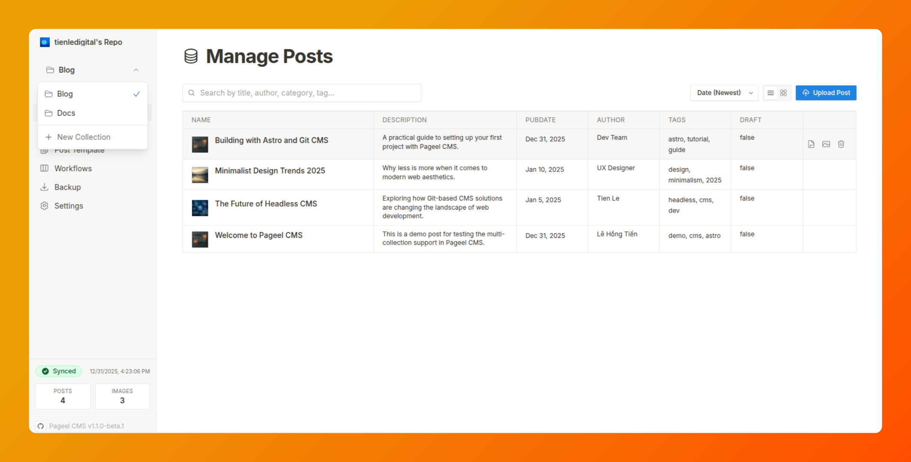

# Pageel CMS

> **Version:** 1.1.0-beta.1 | **Updated:** February 2026

A powerful, client-side Content Management System (CMS) for managing Markdown/MDX content and images directly on **GitHub**, **Gitea**, or **Gogs** repositories. Built with **React 19** and **TypeScript**, featuring a modern Notion-inspired UI.

<div align="center">
  <a href="https://pageel.com">
    
  </a>
</div>

<div align="center">
  <h1>Git-native CMS for Astro & Next.js</h1>
  <p>Run entirely in your browser. No database. No backend.</p>

[](LICENSE)
[](CHANGELOG.md)


</div>

---

<div align="center">
  <a href="README.md">🇺🇸 <b>English</b></a> | <a href="README.vi.md">🇻🇳 Tiếng Việt</a>
</div>

---

## 📸 Screenshots

<p align="center">
  
</p>

---

## ✨ Key Features

| Feature                   | Description                                                                             |
| :------------------------ | :-------------------------------------------------------------------------------------- |
| 📚 **Multi-Collection**   | Manage multiple content types (Blog, Docs, Projects) in one workspace                   |
| 🏷️ **Typed Templates**    | Define schema with **String**, **Date**, **Boolean**, **Number**, **Array**, **Object** |
| 🔍 **Smart Filtering**    | Auto-generated filter UI based on your template types                                   |
| 🔐 **No Backend**         | Runs entirely in browser, communicates directly with Git APIs                           |
| 🔒 **Secure**             | PAT encrypted with **AES-GCM** (Web Crypto API), stored in sessionStorage               |
| 🌍 **Multi-Platform**     | Supports **GitHub**, **Gitea**, and **Gogs** (self-hosted)                              |
| 🌐 **i18n Ready**         | English and Vietnamese support                                                          |
| ⚡ **Optimistic Locking** | **SHA-check** prevents overwriting concurrent changes                                   |

---

## 🧭 Application Modules

### 1. 📝 Manage Posts (`PostList`)

The central hub for content management.

- **View Modes:** Switch between dense data table or visual card grid.
- **Advanced Filtering:** Filter by text, date range, tags, booleans, and numbers.
- **Smart Sort:** Sort by any field defined in your template.
- **Quick Actions:** Edit frontmatter inline, split-pane Markdown editor, upload/replace files.

### 2. 🖼️ Manage Images (`ImageList`)

Dedicated asset library for managing media files.

- **Gallery View:** Visual grid with lazy-loaded thumbnails.
- **Bulk Upload:** Drag & drop multiple images.
- **Auto Compression:** Client-side optimization (configurable max size/width).
- **Public URL:** One-click copy for absolute or relative paths.

### 3. 📋 Post Template (`TemplateGenerator`)

Define and validate content structure.

- **Visual Editor:** Define fields and types via dropdown UI.
- **Supported Types:**
  - `String` (Text input)
  - `Date` (Date picker)
  - `Array` (Multi-select tags)
  - `Boolean` (Toggle switch)
  - `Number` (Numeric input)
  - `Object` (JSON editor)
- **Schema Generation:** Auto-generate schema from existing posts.

---

## 🚀 Getting Started

### Prerequisites

- Modern browser (Chrome 80+, Firefox 75+, Safari 13.1+)
- Node.js 20.19+ (for local development)
- Git repository on GitHub, Gitea, or Gogs

### 1. Clone & Install

```bash
git clone https://github.com/pageel/pageel-cms.git
cd pageel-cms/core
npm install
```

### 2. Run Development Server

```bash
npm run dev
```

Open [http://localhost:3000](http://localhost:3000) in your browser.

### 3. Generate Access Token

| Provider       | Permissions Required          |
| :------------- | :---------------------------- |
| **GitHub**     | **Contents** (Read and Write) |
| **Gitea/Gogs** | **Repo** (Read and Write)     |

### 4. Connect Repository

1. Select your Git service.
2. Enter repository (e.g., `username/repo`).
3. Paste your access token.
4. (Self-hosted) Enter instance URL.

---

## 🏗️ Technical Architecture

### Tech Stack


### Core Design Patterns

**1. Adapter Pattern (`IGitService`)**
Abstracts Git operations for GitHub (`GithubAdapter`), Gitea (`GiteaAdapter`), and Gogs (`GogsAdapter`).

**2. Client-Side Encryption**

- Personal Access Tokens (PAT) are encrypted using **AES-GCM**.
- Enrollment key is generated via `crypto.getRandomValues()`.
- Nothing is ever sent to our servers.

**3. State Management**

- **Zustand** for global app state.
- **IndexedDB** / **localStorage** for settings and cache.
- **URL Query Params** for deep linking state.

---

## 🌐 Ecosystem

| Product            | Type       | Purpose                                       |
| :----------------- | :--------- | :-------------------------------------------- |
| **Pageel CMS**     | OSS (MIT)  | Git-native CMS for content & media            |
| **Pageel Workhub** | Commercial | Team workspace: workflow, review, permissions |

> Pageel CMS focuses on **content**. For team collaboration features, see Pageel Workhub.

---

## 🤝 Contributing

Contributions are welcome! Please see our [Contributing Guide](./docs/guides/CONTRIBUTING.md) for details.

1. Fork the repository
2. Create feature branch (`git checkout -b feature/amazing-feature`)
3. Commit changes (`git commit -m 'Add amazing feature'`)
4. Push to branch (`git push origin feature/amazing-feature`)
5. Open a Pull Request

---

## 📄 License

This project is licensed under the **MIT License**. See the [LICENSES.md](./LICENSES.md) file for details.

---

<p align="center">
  Made with ❄️ by <a href="https://www.pageel.com">Pageel</a>
</p>
